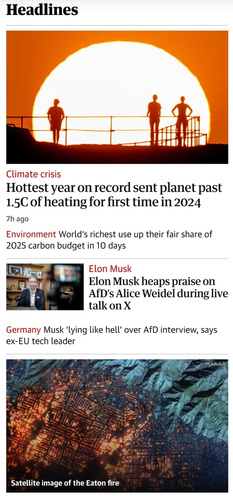

    

 

Not a great start to 2025, is it? Last night I was feeling particularly gloomy about the world, so I felt compelled to rewatch *Don't Look Up*, Adam McKay's 2021 satire on the sorry state of US politics and climate inaction. The film received fairly mixed reviews on release, which mirrored my own feelings on the film (I initially gave it 3/5 stars, which felt quite generous at the time). This time around, however, I have to side with <a href="https://www.currentaffairs.org/news/adam-mckay">Nathan J. Robinson</a> and <a href="https://www.theguardian.com/commentisfree/2022/jan/04/dont-look-up-life-of-campaigning">George Monbiot</a>:

>*No wonder journalists have slated it. They've produced a hundred excuses not to watch the climate breakdown satire Don't Look Up: it's "blunt", it's "shrill", it's "smug". But they will not name the real problem: it's about them.*

The film lover in me certainly still has a few criticisms—moments when I caught myself selfishly wishing that the film was more "artful" because that's what tickles my Netflix-despising cinephile brain. However, I rewatched this not as a film nerd but as an activist and scientist, and as such, it did hit differently. I'm just *so tired*, endlessly tired of our future being sold off to a bunch of spineless, self-centered, hate-stirring oligarchs. Don't get me wrong, I'm no doomer and will continue to be active and do what I can, but I also need my moments of catharsis and relief to keep me going, and for this reason, I have to give this film credit where credit is due.

If you don't like this film (which is fine), I recommend a few books instead: *Merchants of Doubt* by Naomi Oreskes and Erik M. Conway, *Doughnut Economics* by Kate Raworth, *Less Is More* by Jason Hickel, and most things written by Naomi Klein and George Monbiot.

>*There is no substitute to democratic politics, to organising, never accepting defeat. There is no final defeat, there is no final victory, there are no guarantees. We may lose forever, and, in any case, we are facing a climate catastrophe. But, as I keep telling my friends and my comrades: I know I am going to die; that is no reason for me to wake up in the morning and not to have vivacity, and energy, and to try to make a good day of it.*
>
>—Yanis Varoufakis
